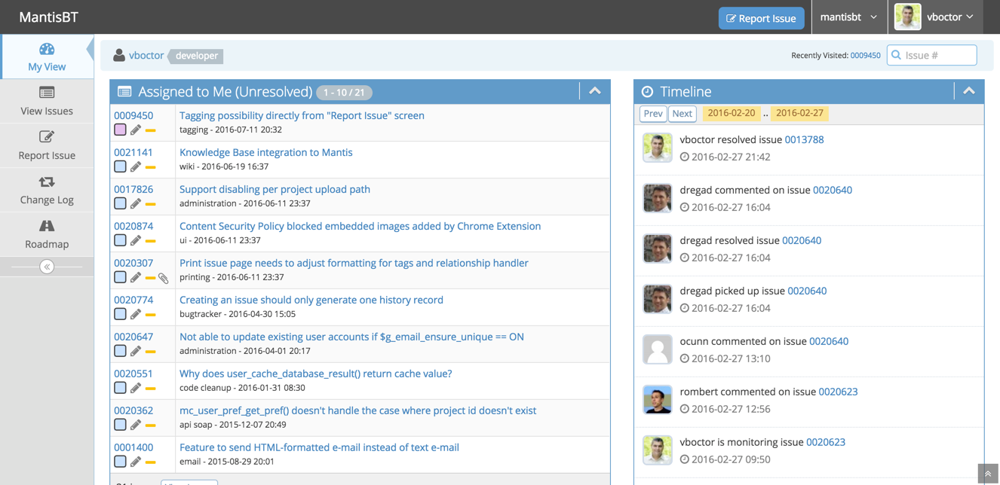

<!--
To README zostało automatycznie wygenerowane przez <https://github.com/YunoHost/apps/tree/master/tools/readme_generator>
Nie powinno być ono edytowane ręcznie.
-->

# Mantis dla YunoHost

[](https://ci-apps.yunohost.org/ci/apps/mantis/)


[](https://install-app.yunohost.org/?app=mantis)

*[Przeczytaj plik README w innym języku.](./ALL_README.md)*

> *Ta aplikacja pozwala na szybką i prostą instalację Mantis na serwerze YunoHost.*  
> *Jeżeli nie masz YunoHost zapoznaj się z [poradnikiem](https://yunohost.org/install) instalacji.*

## Przegląd

MantisBT is an open source issue tracker that provides a delicate balance between simplicity and power. Users are able to get started in minutes and start managing their projects while collaborating with their teammates and clients effectively.


**Dostarczona wersja:** 2.27.0~ynh1

**Demo:** <https://mantisbt.org/bugs/my_view_page.php>

## Zrzuty ekranu



## Dokumentacja i zasoby

- Oficjalna strona aplikacji: <https://mantisbt.org/>
- Oficjalna dokumentacja dla administratora: <https://mantisbt.org/documentation.php>
- Repozytorium z kodem źródłowym: <https://github.com/mantisbt/mantisbt/>
- Sklep YunoHost: <https://apps.yunohost.org/app/mantis>
- Zgłaszanie błędów: <https://github.com/YunoHost-Apps/mantis_ynh/issues>

## Informacje od twórców

Wyślij swój pull request do [gałęzi `testing`](https://github.com/YunoHost-Apps/mantis_ynh/tree/testing).

Aby wypróbować gałąź `testing` postępuj zgodnie z instrukcjami:

```bash
sudo yunohost app install https://github.com/YunoHost-Apps/mantis_ynh/tree/testing --debug
lub
sudo yunohost app upgrade mantis -u https://github.com/YunoHost-Apps/mantis_ynh/tree/testing --debug
```

**Więcej informacji o tworzeniu paczek aplikacji:** <https://yunohost.org/packaging_apps>
